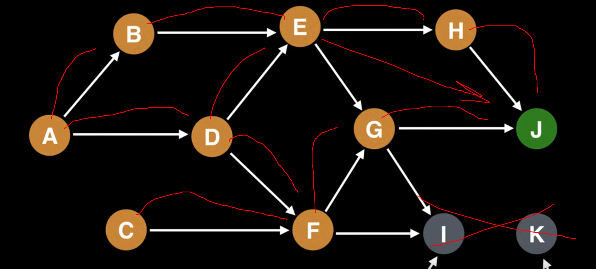

## Graphs
graph **G=(V,E)**
1. V - set of vertices
2. E - set of edges

**Undirected graph** - edges in both directions

## Graph Representations
###  Adjacent Matrix

```
i/j : 1 2 3 4
1 : 0 1 0 1
2 : 1 0 1 0
3 : 0 1 0 1
4 : 1 0 1 0
```
### Adjacent List
List of list where each element is list that contains all the verticles 
adjacent to vertx with index **i**

```
A1 → 2 → 4
A2 → 1 → 3
A3 → 2 → 4
A4 → 1 → 3
```

## Topological Sort
**Topological sort** - linear ordering of all its verticles Where
for each directed edge from node A to node B , node A appears before node B


## Spanning Tree
**Spanning Tree** - is a tree that lives inside a graph
and it should hit all the verticles in the graph

## Minimum Spanning Tree
Tree with the least weight


### Sorted


[DFS](DFS)
