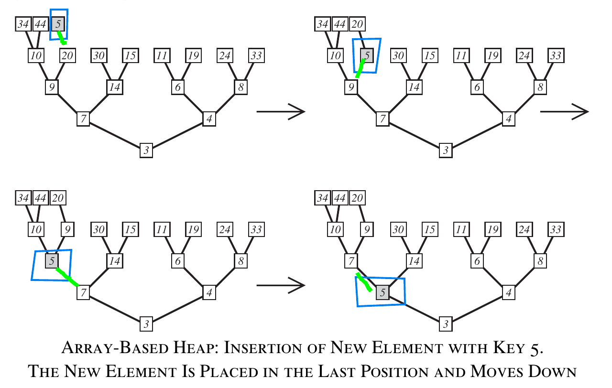
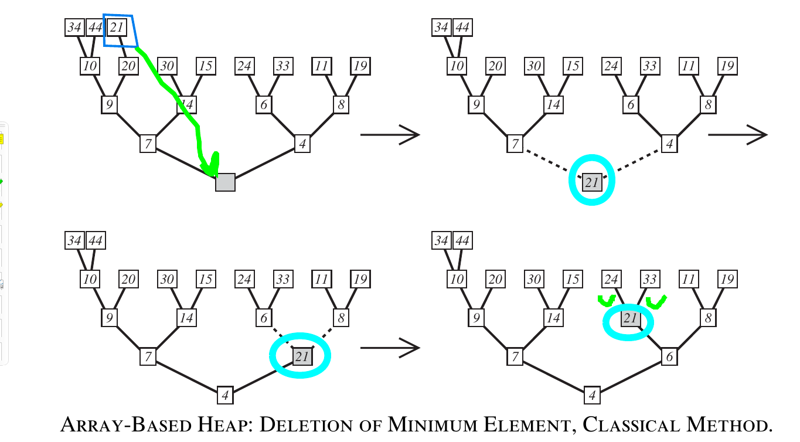

Heap
=======

## Heap Definition

* **Heap** - for every node **v** other than root , the key stored at T is greater than key stored at v's parent 

* In heap,every node is smaller that it's children
* `heap_key[i] < heap_key[2i+1] if 2i+1 < n` where **n** is the number of elements
* `heap_key[i] < heap[2i+2] if 2i+2 < n`

## Insert example

## Delete example

