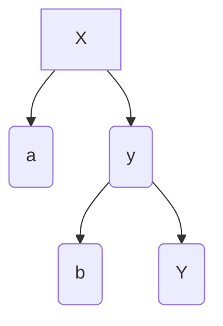
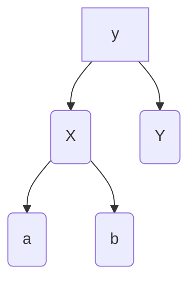
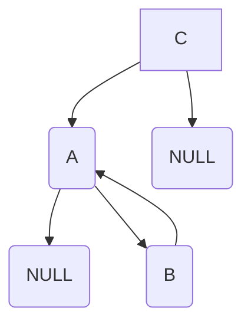
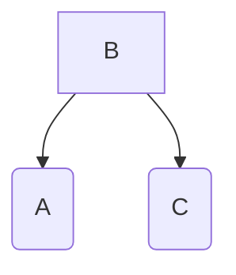
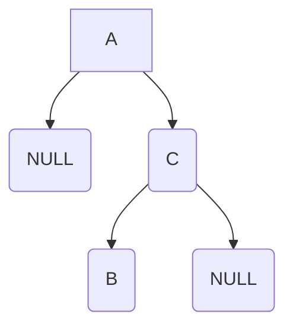

# AVL TREE
**AVL** Tree allows heights of left and right child to differ at most +- 1.

## AVL Trees are balanced
Worst case is when right subtree has height 1 more than left for every node.  
```
h < 2/lgN
N(h) = 1 + N(h-1) + N(h-2)
```
## Left rotation

**Rotate x**
- right child(**y**) must be non null
- makes **y** new root with **x** as it's left child
- **y**'s left child as **x**'s right child   


## Right rotation

**Rotate y**
- left child(**x**) must be non null
- makes **x** new root with **y** as it's right child
- **x**'s right child as **y**'s left child   


## Left-right rotation
A node has been inserted into the right subtree of the left child


- Left rotation on the tree **A**
- Right rotation of **B**


## Right-left rotation
A node has been inserted into the left subtree of the right child

