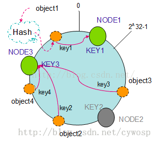
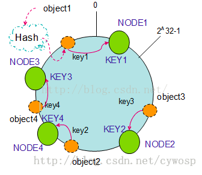

## Hashing
Nodes and keys are mapped using the same hash algorithm
For example
```
hash(key1) = 3
hash(key2) = 10
hash(key1) = 15
hash(NODE1) = 5
hash(NODE2) = 17
```
Now when we want to fetch `key1` we hash it to get `3` and search for node whose
hashed value is first greater , `NODE1` has value 5 which is greater so it's a 
server with this key->value

## Virtual Nodes
If we want to evenly distribute keys among servers we can introduce virtual servers
```
hash(key1) = 3
hash(key2) = 10
hash(key1) = 15
hash(NODE1_1) = 5
hash(NODE2_2) = 17
```
Algorithm is the same but now we get virtual node `NODE1_1` then get first part 
which is `NODE_1` which means key in first node.

## What happen when Node is deleted


If Node2 was deleted object3 will be lost but others keys are still in the same caches

## Add node


If Node4 was added then `object2` will be lost but others will be the same
