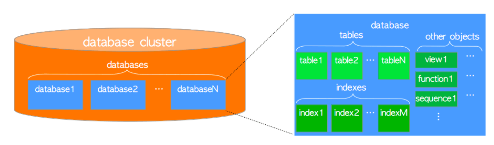

## Database cluster

First of all , don't confuse with **group of servers**. **Database cluster** is a collection of database objects



All db objects have respective **Object identifier** 

```
SELECT datname, oid FROM pg_database;
<Down>-[ RECORD 1 ]-------------------------
datname | postgres
oid     | 13434


Which means that Database Postgres is located here /var/lib/postgresql/12/main/base/13434
```


## Db config files

- **pg_hba** - Auth
- **pg_ident** - user name mapping
- **postgres.conf** - config files

## Layout

Each table or index whose size is less than 1 GB is a single file.  
For example oid for table **test** is **16384**

```
SELECT relname, oid, relfilenode FROM pg_class WHERE relname = 'balance';

relname     | balance
oid         | 21257
relfilenode | 21257

```
In this case table **balance** is located here `vim /var/lib/postgresql/12/main/base/16384/21257`.  
The same could be achieved with this query `SELECT pg_relation_filepath('balance');`

As soon as balance table exceed 1Gb Postgres will create another file **21257.1**
