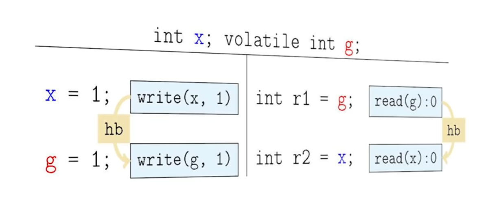
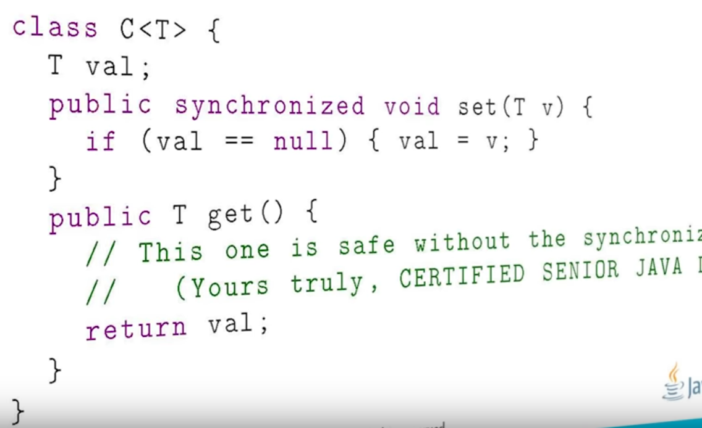

## Happens before
Memory model is about which values are visible for thread at any given time
### Synchronized actions
1. Volatile read
2. Volatile write
3. Lock/Unlock Monitor
4. First and last action of the thread
5. Action that starts a thread and action that detects thread termination


### Happens-before relationship
#### Unlock of monitor happens before every subsequent lock
```
synchronized void test(){
    a = 1
}
```
Every thread that aquires lock will see that previous thread wrote 1 to **a**

#### Write to volatile happens before every read

#### A call to `t2.start()` of thread happens before any action inside of `t2`

#### All actions in made by thread are visible by second thread if thread 2 calls `t1.join()`

## Exercises
#### Thread sleep

```
class BadThreads {

    static String message;

    private static class CorrectorThread
        extends Thread {

        public void run() {
            try {
                sleep(1000); 
            } catch (InterruptedException e) {}
            // Key statement 1:
            message = "Mares do eat oats."; 
        }
    }

    public static void main(String args[])
        throws InterruptedException {

        (new CorrectorThread()).start();
        message = "Mares do not eat oats.";
        Thread.sleep(2000);
        // Key statement 2:
        System.out.println(message);
    }
}
```
Main thread will print `Mares do eat oats` however this is not guaranteed because there is
no happens-before relationship between two Key statements.
`Thread.sleep()` doesn't have any synchronized semantics

#### Happens before order

Two possibilities
#####  Read of `r1` in thread 2 happened before write
In this case thread 2 doesn't have to see `x=1`

#####  Write of `g1` in thread 1 happened before read of `g1`
In this case thread 2 has to see `g=1` and also `x=1` because everything happened before write to `g1` is also happened before read of `r1` in thread 2

#### Synchronized write vs plain read

In this case `get()` will not see write because write and read are not 
linked with happens-before guarantee
> In order to fix it we have to declare `val` as `volatile`
