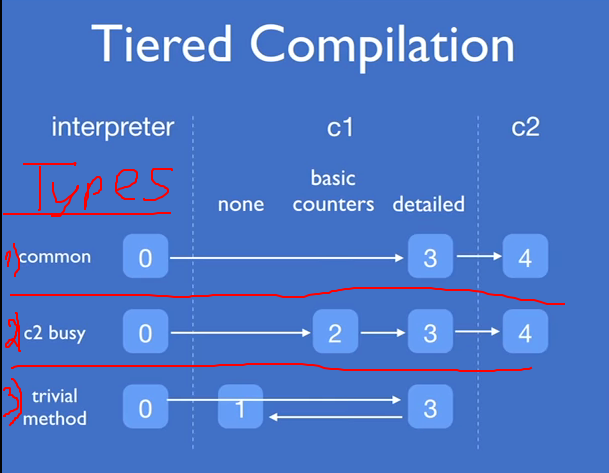

# JIT

### Tiered compilation
In Java 8 by default JVM started in Tiered mode when C1(client) is used first
and then code is compiled using C2(server)



1. From Interpreter to C2
2. If C2 busy the use C1
3. If C1 thinks it's easy to compile it then no need to C2

## Hot reload
1. Add these two JVM options `-Xverify:none -XX:TieredStopAtLevel=1`(TieredStopAtLevel)
2. Run app in debug mode, when class is changed press `Ctrl+Shift+F9`

## Code cache
1. InitialCodeCacheSize
2. ReservedCodeCacheSize
3. CodeCacheExpansionSize

At some point there are same versions of the same compiled method by different JIT<br>
Let's say we have Tier3 method, it will be cached but then then method<br>
can be compiled by Tier4.

Method/Loop is complied if it was executed certain amount of time.\
**-XX:CompileThreshold** - specifies this threashold.
1. 1500 for client
2. 10_000 for server

When method is going to be complied it's placed in the queue
and then each element of this queue is compiled

## On stack replacement
When loop is running in Inerpreter and then it was compiled then the next iteration<br>
of loop will be swapped from interpreter to compiled mode (In debug it's displayed using @ sign)

## Jit optimizations

### Inline
Inline method calls
```
Point p = ...
p.setA(p.getA) // no inline
p.A = ... //inline
```
Methods that are less than **-MaxInlineSize** and that are hot will be inlined

### Deoptimization
Let's say that method has condition which is always true, then JIT will remove this condition.
But if once the condition is false then JIT will deoptimize this method.

## JVM Optimization


## Resources 
1. https://phauer.com/2017/increase-jvm-development-productivity/
2. [Talk about JIT](https://www.youtube.com/watch?v=FnDHp3Qya6s)
3. [Book about jit](https://www.oreilly.com/library/view/java-performance-the/9781449363512/ch04.html)
4. https://docs.oracle.com/javase/8/embedded/develop-apps-platforms/codecache.htm
