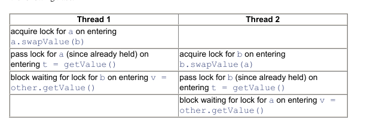
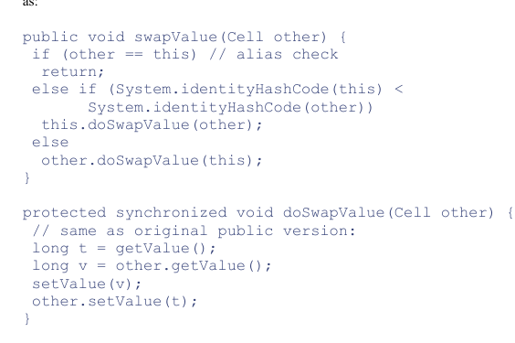

## Synchronized

* If parent has synchronized method then child doesn't inherit synchronization
* Methods in interface can't be declared as synchronized 
* Constructors can't be declared as synchronized  
* Synchronized block can be used inside ctor.
* Synchronized method can call another synchronized method which uses the same lock without freezing
* If lock is free then there is no guarantee which thread will hold it (**No fairness guarantee**)
* **JVM internally obtein lock for Class object during class loading**

**Synchronized method and sycnhronized block which uses instance of class will use the same lock**

Example:

```
static class Sync {
        synchronized void say() {
            try {
                Thread.sleep(3000);
            } catch (InterruptedException e) {
                Thread.currentThread().interrupt();
            }
            System.out.println("Sleep");
        }

        void say2(Sync sync) {
            synchronized (sync) {
                System.out.println("Tut");
            }
        }
    }

    public static void main(String[] args) throws InterruptedException {
        final Sync sync = new Sync();
        new Thread(sync::say).start();
        Thread.sleep(1000);
        final Sync sync1 = new Sync();
        sync1.say2(sync);
    }
```

Here *say2()* will wait for *say()* because *say2()* uses the same instance of *Sync* class

### Example of dead lock

```
class Cell{
	long value;
	synchronized long get();
	synchronized void set(long);
	synchronized void swap(Cell other){
		long t = getValue();
		long v = other.getValue();
		setValue(v);
		other.setValue(t);
	}

}
a.swap(b) | b.swap(a)
```
Flow



**How to prevent ?**



**Explanation**

Let's say A > B (hash code). Then when A enters **swap** then it calls **a.doSwap(b)** and when B enters **swap** it calls **a.doSwap(b)** as well.
A calls own **getValue** and doesn't block on sync then it calls **b.getValue** B lock is free that is why it doesn't wait and so on.
