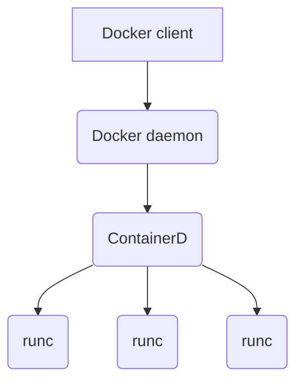

## Docker
* Running container uses the kernel	of the host machine

#Image
**Image** - an object that contains OS filesystem and an application.
It's a template.

#Container
`docker container run -it ubuntu:latest /bin/bash`   
 **it** - tells to attach current terminal to the container
 
 To attach to docker container run `exec`   
 `docker container exec -it name bash`

- **runc** - creates containers
- **containerd** - container supervisor

Lifestyle:   
- Docker client `docker container run`
- **Docker daemon** receive cli instruction
- **Containerd** gives **runc** instuction to create container 
- **runc** creates container runtime

1. [Image](Image)
2. [Containers](Containers)
3. [Internals](Internals)
4. [Volumes](Volumes)
