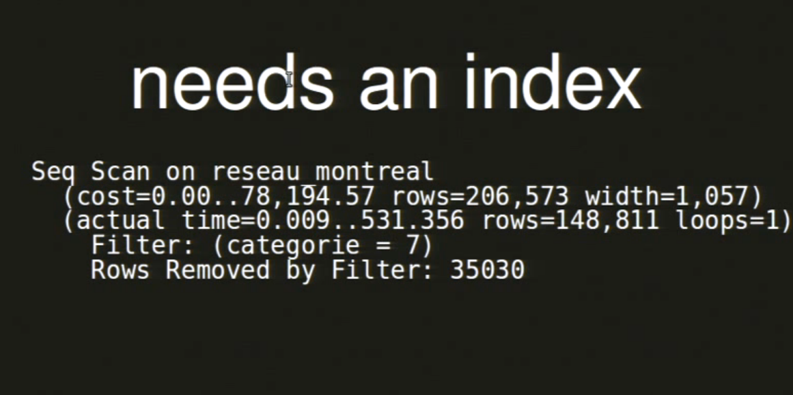
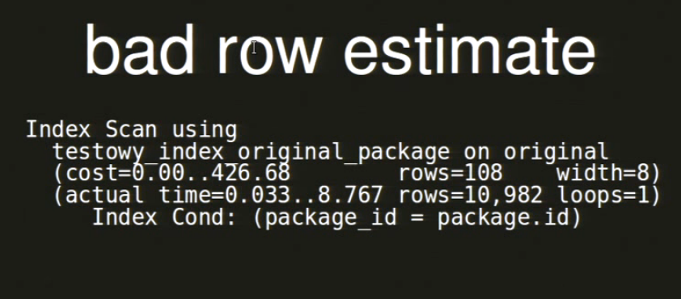

# Explain
Explain doesn't do
1. Show why index was skipped
2. Show how to rewrite query
3. Show network problems


# Sequence types
1. Sequential table scan\
   `Scan all rows in table`
2. Index scan
3. Index only scan 
4. Bitmap scan 

		- scan index
		- saves all pages locations in DS called bitmap
		- if multiple indexes are used then create multiple bitmaps
		- merge them
		- sort bitmap in order to get sequetial access from disk

# Join types
1. Nested Loop
2. Hash join

		1. Get first relation and create hash table from it
		2. And then do sequential scan in second table
		3. Get each element and check if this element is present in hash table
		4. Complexity - O(n)(create_hash) + O(m)(iterate from second table)
3. Merge join

		1. If query has ORDER BY then
		2. Sort two result sets ahead of time
		3. Of they have equal size then just iterate over
	       first and check element from second in the same position
		   
# Examples
**Needs an index**


35030 rows were removed by filter 

**Bad rows estimate**

Estimated rows - 108\
Real rows - 10982\
Need analyze


## Explain examples
```
EXPLAIN SELECT * FROM tenk1 WHERE unique1 < 100;

                                  QUERY PLAN
------------------------------------------------------------------------------
 Bitmap Heap Scan on tenk1  (cost=5.07..229.20 rows=101 width=244)
   Recheck Cond: (unique1 < 100)
   ->  Bitmap Index Scan on tenk1_unique1  (cost=0.00..5.04 rows=101 width=0)
         Index Cond: (unique1 < 100)
```

> When amount of rows is too big then bitmap is switched to lossy mode when 
> bitmap remembers all rows
> but condition is rechecked when fetching actual row
> ! Note that even for a small number of retrieved rows 
> RECHECKED is shown in plan anyway
1. Index scan is used to find rows
2. Locations are saved in bitmap
3. Bitmap recheck condition
4. Sort them
5. And fetch from table

```
EXPLAIN SELECT * FROM tenk1 WHERE unique1 < 100 AND unique2 > 9000;

                                     QUERY PLAN
-------------------------------------------------------------------------------------
 Bitmap Heap Scan on tenk1  (cost=25.08..60.21 rows=10 width=244)
   Recheck Cond: ((unique1 < 100) AND (unique2 > 9000))
   ->  BitmapAnd  (cost=25.08..25.08 rows=10 width=0)
         ->  Bitmap Index Scan on tenk1_unique1  (cost=0.00..5.04 rows=101 width=0)
               Index Cond: (unique1 < 100)
         ->  Bitmap Index Scan on tenk1_unique2  (cost=0.00..19.78 rows=999 width=0)
               Index Cond: (unique2 > 9000)
```

1. Use index on unique1 and create bitmap
2. Use the same index but with different condition
3. BitmapAnd to merge to bitmaps
4. Heap scan

```
EXPLAIN SELECT * FROM tenk1 WHERE unique1 < 100 AND unique2 > 9000 LIMIT 2;

                                     QUERY PLAN
-------------------------------------------------------------------------------------
 Limit  (cost=0.29..14.48 rows=2 width=244)
   ->  Index Scan using tenk1_unique2 on tenk1  (cost=0.29..71.27 rows=10 width=244)
         Index Cond: (unique2 > 9000)
         Filter: (unique1 < 100)
```

This is the same query as above but with limit.\
In this case planner decided to use index on condition **>9000**
and apply FILTER <100 on each row from index

```
EXPLAIN SELECT *
FROM tenk1 t1, tenk2 t2
WHERE t1.unique1 < 10 AND t2.unique2 < 10 AND t1.hundred < t2.hundred;

                                         QUERY PLAN
---------------------------------------------------------------------------------------------
 Nested Loop  (cost=4.65..49.46 rows=33 width=488)
   Join Filter: (t1.hundred < t2.hundred)
   ->  Bitmap Heap Scan on tenk1 t1  (cost=4.36..39.47 rows=10 width=244)
         Recheck Cond: (unique1 < 10)
         ->  Bitmap Index Scan on tenk1_unique1  (cost=0.00..4.36 rows=10 width=0)
               Index Cond: (unique1 < 10)
   ->  Materialize  (cost=0.29..8.51 rows=10 width=244)
         ->  Index Scan using tenk2_unique2 on tenk2 t2  (cost=0.29..8.46 rows=10 width=244)
               Index Cond: (unique2 < 10)
```

1. Materialize - rows=10 but db will read all rows at once and save them in memory.
2. The second index will be scanned using Bitmap
3. Both results will be joined using nested loop

```
EXPLAIN SELECT *
FROM tenk1 t1, tenk2 t2
WHERE t1.unique1 < 100 AND t1.unique2 = t2.unique2;

                                        QUERY PLAN
------------------------------------------------------------------------------------------
 Hash Join  (cost=230.47..713.98 rows=101 width=488)
   Hash Cond: (t2.unique2 = t1.unique2)
   ->  Seq Scan on tenk2 t2  (cost=0.00..445.00 rows=10000 width=244)
   ->  Hash  (cost=229.20..229.20 rows=101 width=244)
         ->  Bitmap Heap Scan on tenk1 t1  (cost=5.07..229.20 rows=101 width=244)
               Recheck Cond: (unique1 < 100)
               ->  Bitmap Index Scan on tenk1_unique1  (cost=0.00..5.04 rows=101 width=0)
                     Index Cond: (unique1 < 100)
```

1. unique<100 will be scanned and hashed
2. Then hash join will be used to join hash table with tenk2
