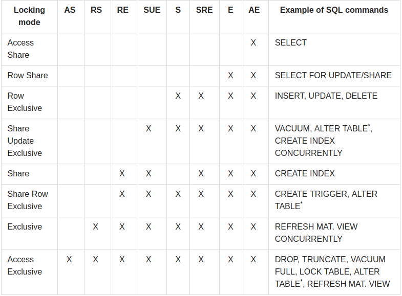

## Locking

How to work with it?

1. Let's execute **Create index** that holds **Share** lock.			
   If the second session will execute **Create index** then it 
   won't wait for the first one because **Share** indexes doesn't block each other.
   At the same time DROP TABLE will wait because it aquires **AccessExclusive** lock that is blocked by **Share**
2. One transaction execute SELECT statement , another transaction runs Vacuum. 
   Vaccum will wait for first transaction because AcessShare blocks AccessExclusive
    

Locks are queued. For example
1. First transaction execute select
2. Second transaction execute Vacuum full and waits for first transaction
3. Third transaction is select and it waits for vacuum which waits for first transaction

