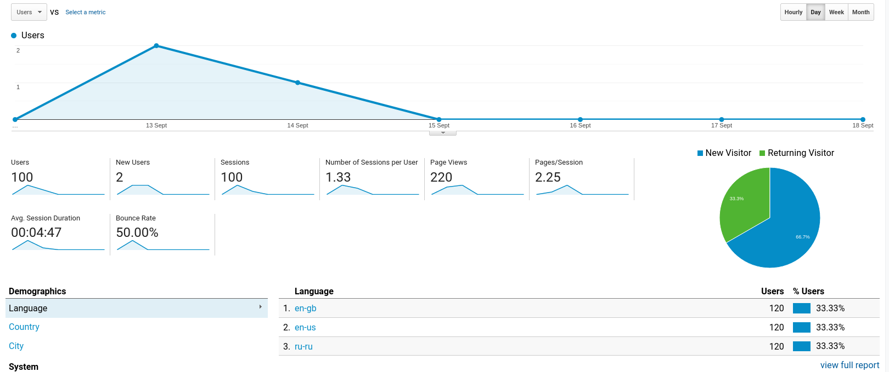

# Assignment 2 Almas Abdrazak 300324208

# Question 1

## 1. Introduction
Web mining is a technique to discover information and predict patterns from the Web Content(1,Nasrin JOKAR). According to Jokar, there are three types of web mining. The data can be collected from a log files in a server, relational data from DBMS(database management system) and binary data from user images, videos and documents. According to Jokar(1, Nasrin JOKAR) , there are 3 methods used in web mining namely 
1. Web content mining - main goal is to extract information from html pages that can include
    1. Links to other documentations using `a` tag
    2. Embedded images and videos using `img` and `iframe` tags
    3. General text information within `p`,`h` tags
2. Web structure mining - main goal is to create a graph from an html page and extract useful information from this graph
    1. First html page will be the root node of a graph
    2. All embedded links will be treated as separate nodes with edges that connect these nodes with root
    3. This process will continue by going into each individual link and create the same node/edge relationship until the last document without any links is reached
3. Web usage mining - Analize users behaviour on a web page and collect a general information about the users. The greatest example is Google Analytics which is a free way to add users tracking into your website(2, Google Analytics)
    1. Which links users visited
    2. Which browser they used
    3. Which operating system they used
    4. From which countries these users are

(Figure 1, The google analytics from my website - https://strogiyotec.github.io/)

The main goal of web mining is to find and predict users navigation patterns(1,Nasrin JOKAR).

## 2. Web mining tools
According to Jokar(1, Nasrin JOKAR) there are three main techniques for data mining namely "association rules, sequential patterns, and clustering". 

### 2.1 Association rules
Mainly used to provide recommended pages(1, Nasrin JOKAR). The rule can be represented in the following format `A.html, B.html => C.html`(1, Nasrin JOKAR). The meaning is , if the user visited page A and B then most probably theeuser will intend to visit page C(1, Nasrin JOKAR). We can see a real example from the Amazon web page, if user tries to find a book by keyword "Microservices" Amazon will give a list of recommended books which user can buy along with a former book

(Figure 2, Amazon recommendation pages)

### 2.2 Sequential patterns
Sequential patterns are used to discover user navigation patterns(1, Nasrin JOKAR). Jokar gives the following example: "70% of users who have first observed page A.html and then page B.html, have observed page C,html in the same session , too"(1, Nasrin JOKAR). This example looks really similar to Association rules, however , according to Bing , Sequential patterns carry the notion of time or timestamp so analytics can see how long it took for a user to switch to another page(3, Liu Bing). WAP-tree(Web access pattern tree) is an algorithm used for Sequential patterns. This algorithm constructs a WAP-tree data structure from an initial database scan(here comes the difference, when we scan database , the rows have to be ordered by time from last to newest) it then performs a mining on constructed tree to find frequent patterns(4,Kezban Dilek Onal)

### 2.3 Clustering
The last technique is Clustering and it's used to group similar users together(1, Nasrin JOKAR). One of the main use cases for web mining clustering is to partition market in e-commerce.

## 3. Main algorithm
As the main algorithm for this paper , **bag-of-keypoints** was chosen. 
It's hard to detect patterns in images or other binary data. A lot of algorithms exist to deal with text data because it's easier to categorise text data rather than binary 0 and 1. However, nowadays more and more web platforms provide their services as a binary data. As as example is 1 million images uploaded to facebook daily(5, Doug Beaver). Apart from images we have a video streaming platforms such as youtube and twitch.
The evolving nature of visual categories motivates researches to come up with new machine learning algorithms(6,Gabriella Csurka). The **bag-of-keypoints** is one the simplest algorithm in this field. " A bag of keypoints corresponds to a histogram of the number of occurrences of particular image patterns in a given image"(6, Gabriella Csurka).
This algorithm is heavily inspired by **bag-of-words** algorithm for text categorization(6, Gabriella Csurka).
 The algorithm is explained in detail by STEPHEN O’HARA. According to Stephen(7, Stephen O’HARA) **Bag-of-words** works in the following way.
 
 
 1. The text document has to be represented as " normalized histogram of word counts"(count all the words from the dictionary that present in this document)
 2. Dictionary can contain skip words without a meaning for a researcher such as particles "a","the".
 3. These counts then converted into a **term vector** "each element is a term in the dictionary and the value of that element is the number of times the term appears in the document divided by the total number of dictionary words in the document"(7, Stephen O’HARA).

### 3.1 Local Descriptors
In order to explain how **bag-of-keypoints** works we have to start with a definition of **Local Descriptors**.
As described by  Farquhar(8,J.D.R. Farquhar) "Local descriptors are image features which are defined over a limited spatial extent".
For an algorithm to work , at least one of the descriptor has to be present. An example given by Farquhar(8,J.D.R. Farquhar) shows that at least one wheel has to be visible from any aspect, or in other words wheel has to be detected even if "viewpoint, illumination or instance " was changed. With a valid algorithm implementation, the wheel descriptor will produce the same descriptor for different types of cars and pictures of these cars from different angles(8,J.D.R. Farquhar). As was described earlier , the algorithm is based on  **bag-of-words** which works with a dictionary of words. In case of images, dictionary words are called **patches**.
The local descriptor generation is a two step process, first image patches are identified based on the field of interest and then descriptor generation where a "feature vector describing the local patch is generated"(8,J.D.R. Farquhar).
According to O’HARA(7,STEPHEN O’HARA), the most popular algorithm for feature
descriptor is Scale Invariant Feature Transform(SIFT), O'HARA describes it as
"the 128 dimensional SIFT descriptor is a histogram of responses to oriented gradient filters. The responses to 8 gradient orientations at each of 16 cells of a 4x4 grid generate the 128 components of the vector".

### 3.2 Key-Points
When a set of patch descriptions is ready for each image, the next step is to identify key-points(8,J.D.R. Farquhar). Those are just a prototypes of the image patch described above. One of the way to do it is to use **k-means algorithm**.
Using k-means, algorithm assigns points to their closest cluster(6,Gabriella Csurka). Moreover, k-means can be run multiple times to select final clustering with lowest empirical risk(6,Gabriella Csurka).

### 3.3 Categorization
"Once descriptors have been assigned to clusters to form feature vectors, we reduce the problem  of  generic  visual  categorization  to  that  of  multi-class  supervised  learning"(6,Gabriella Csurka). This can be done using Naïve Bayes algorithm. It works int the following way:
1. Given a set of labeled images `images = range(labeled_images)` and a vocabulary of clusters `clusters = range(labeled_clusters)`
2. Each descriptor is labeled with cluster it lies closest to
3. We then count number of times cluster with index `i` appears in image
4. We apply Bayes to image and take "the  largest  a  posteriori score as the prediction"

### 3.4 Example
The following is a description of an experiment conducted by Gabriella Csurka.
Given a set of 1776 images with seven classes:"faces,  buildings,trees, cars, phones, bikes and books"(6,Gabriella Csurka).

(Figure 3, example of images, taken from Gabriella Csurka paper)

These images have different resolutions, color schemes, and positions(for example people faces from different angles). The whole image dataset consists of "792 faces,150 buildings,150 trees, 201 cars, 216 phones, 125 bikes and 142 books"(6,Gabriella Csurka).
The result table from applying **bag-of-keywords** algorithm is given below

(Figure 4, the result table taken from Gabriella Csurka paper)

As you can see, all keywords were categorized with a high accuracy

## 3.5 When not to use **bag-of-keywords**
As we saw earlier , this algorithm is a great way to find similar pictures based on user defined keywords(patches). However, according to Gabriella(6,Gabriella Csurka)  it can't deal with the following problems.
1. Recognition - algorithm can't distinguish two similar objects because they would be put into the same cluster(For example 2 cars from different brands)
2. Content Based Image Retrieval - cases when we need to extract a text or sub image from base image.
3. Detection - decide whether a member of "one visual category" is present in a given image.

# Question 2 - What happens in Web Usage mining Field
As was said in the beginning, Web Mining which deals with the extraction of interesting knowledge from logging information produced by web servers. The main datasource for this type of mining is Web Servers. Using user's IP address and session information the user behaviour can be reconstructed for specific period of time.

## 2. Data preparation
First step in usage mining is called Preprocessing. According to Federico(9, Federico Michele Facca) it containts 4 steps
1. date cleaning - remove the data from data logs which don't contain a usefull information such as what type of images user requested
2. reconstruction of user session - User sends a session Id using browser cookies, using this ip we can match data logs with specific user
3. retriving information about web pages user visited - check what type of html pages were retrived by user and when
4. data formatting - in order to perform usefull actions on the data it can be formatted , an example is to convert log data into sql statements and same them in DBMS to have an ability to use sql against this data

## 3. Applications
There are many use cases for usage mining

### 3.1 Personalization
Web Usage Mining techniques can be used to provide personalized web user experience.For example, users language , country and geolocation can be used to predict which pages user will be interested in(9, Federico Michele Facca).

### 3.2 Prefetching and Caching
The content of most likely visited pages can be prefetched before user even has visited those pages(9, Federico Michele Facca)

### 3.3 Support to the Design
Web usage can be a good tool to improve a UI design. One example is to use Heat Maps from a company named Hotjar. It can show which parts of webpage is accessed the most and the least to check if some parts of UI isn't usefull for a user.

(Figure 5, example of hotjars taken from Hotjars website - https://www.hotjar.com/heatmaps/)

## References
1. Nasrin JOKAR,Web mining and Web usage mining techniques 2016 - http://popups.ulg.ac.be/0037-9565/index.php?id=5371&file=1
2. Google Analytics Page - https://analytics.withgoogle.com/
3.  Liu Bing, Web Data Mining,2011 - https://www.springer.com/gp/book/9783642194597
4. Kezban Dilek Onal, Extracting Multi-item Sequential Patterns by Wap-tree Based Approach - https://www.scitepress.org/Papers/2014/47881/47881.pdf
5. Doug Beaver, Finding a needle in Haystack: Facebook’s photo storage - https://www.usenix.org/legacy/event/osdi10/tech/full_papers/Beaver.pdf
6. Gabriella Csurka, Visual Categorization with Bags of Keypoints - https://citeseer.ist.psu.edu/viewdoc/download?doi=10.1.1.72.604&rep=rep1&type=pdf
7. STEPHEN O’HARA, INTRODUCTION TO THE BAG OF FEATURES PARADIGM FOR IMAGE CLASSIFICATION AND RETRIEVAL - https://arxiv.org/pdf/1101.3354.pdf
8. J.D.R. Farquhar, Improving “bag-of-keypoints” image categorisation: Generative Models and PDF-Kernels - https://core.ac.uk/download/pdf/29138135.pdf
9. Federico Michele Facca, Recent Developments in Web Usage Mining Research - https://sites.ualberta.ca/~golmoham/SW/web%20mining%2023Jan2008/Recent%20Developments%20in%20web%20usage%20mining.pdf
10. Hotjars website - https://www.hotjar.com/heatmaps/
